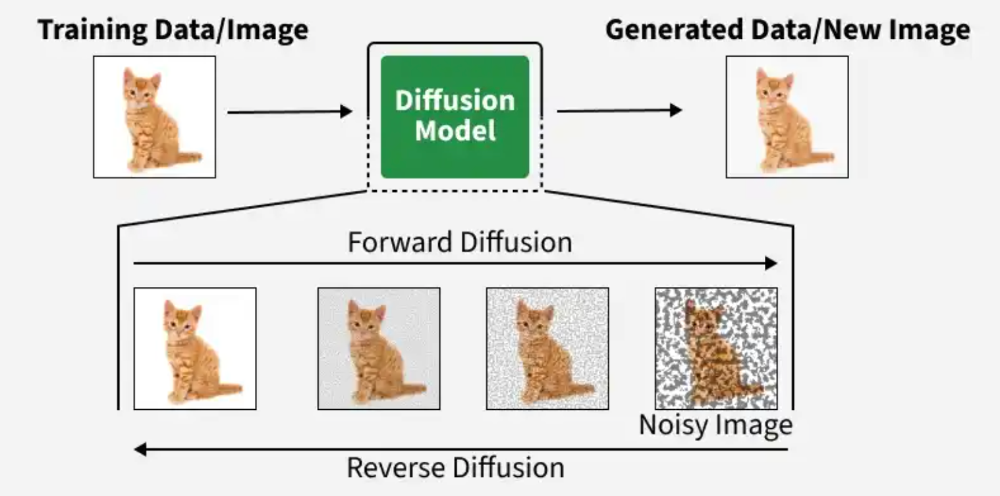
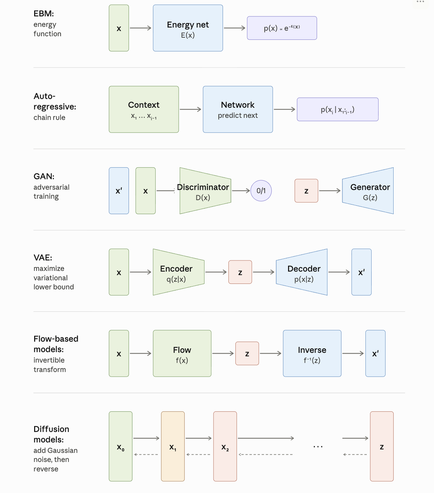

+++
date = '2026-05-20T15:29:19+08:00'
draft = false
title = 'Diffusion Basis (1)'
+++

# Abstract
作为LLM时代最流行的生成模型训练方法, diffusion的过程已经被大家熟知, 互联网上也有大量的教程, 介绍diffusion的训练过程.
但对于大多数不熟悉生成式模型的读者 (比如我), 初学时更重要的问题是*How to understand diffusion naturally?*
对于这个问题相信每个人都有自己的见解, 在diffusion基础的第一篇章, 我们不会深入介绍diffusion的原理细节, 而是先梳理清楚如何最自然地从直觉上接受diffusion本身.

Figure 1: Diffusion Overview

# What is diffusion?
在Wiki上, diffusion model的定义是*a class of latent variable generative models*.
我们会从生成模型开始讲起, 并剖析"generative model"和"latent variable".

模型(现代神经网络)是用于拟合函数映射的, 生成模型顾名思义, 其核心作用一定是帮助生成数据本身.
我们知道无论任何数据 (语言, 图片...), 其一定满足某种结构, 这个结构可以张成一个高维空间. 
但并不是高维空间内所有的坐标都是真实数据, 很多是不可读的乱码, 真实的数据写作随机变量 $X$, 服从某种复杂稀疏分布 $p(x)$.
因此, 设计生成模型的核心问题就是: *how to model $p(x)$ by mapping defined by network*.

不难观察到, 生成模型的设计和判别式模型相比是极其灵活的, 因为判别式模型的输入输出都是定死的, 而生成模型的核心问题就是"如何定义网络的输入输出", 使得我们能生成数据.
我们可以先思考想要通过网络来生成数据, 有哪些可供选择的网络设计:

Figure 2: Design of the different generative models

**(1) 定义输入为数据 $x$ 输出为 $p(x)$ 的点估计, 然后通过sampling来生成数据.**
这一思路的代表性方法是Energy-based Models, 这一思路的代表性方法是 Energy-based Models, 它用一个网络学习能量函数 $E(x)$,通过 $p(x) \propto e^{-E(x)}$ 来定义密度——能量越低的样本越"合理". 但其面临的极大问题就是如何实现 sampling, 往往要通过MCMC等方法, 收敛极慢, 在此不做展开.

**(2) 将 $p(x)$ 分解为 $\prod_i^n p(x_i|x_{1:i-1})$, 定义输出为 $p(x_i|x_{1:i-1})$ 的条件分布.**
这一思路正是AutoRegressive Models的核心思想, 利用数据本身的可拆解性, 将一个难以直接建模的高维联合分布 $p(x)$, 转化为一系列结构相同、维度更低的条件分布的乘积, 这一分解严格成立, 因为它是链式法则(chain rule of probability)的直接应用, 并不引入任何近似——任意联合分布都可以这样无损地展开.

**(3) 直接定义输出为 $x$.**
当前流行的生成模型大多直接将数据 $x$ 作为网络输出. 具体而言, 假设输入为随机变量 $Z$, 神经网络学习的是 $z \to x$ 的映射, 而 $p(x)$ 由 $p(z)$ 和该映射共同决定;一般我们会用高维正态分布来定义 $p(z)$. VAE、GAN 等模型都属于这一范式, 它们的区别在于如何训练这个映射——例如 VAE 会额外引入一个推断网络 $q(z \mid x)$, 通过最大化 ELBO 来学习. Flow-based Models 则走了另一条路: 它要求 $z \to x$ 的映射严格可逆,这样既能用逆映射 $f(x)$ 直接把数据编码成隐变量,又能借助变量替换公式精确计算 $p(x)$.

然而, 用单步映射直接完成 $z \to x$ 这一剧烈的分布变换, 对网络要求很高, 仍有改进空间. 我们注意到一个事实:对任意 $x$ 按特定方式不断添加高斯噪声, 其分布最终会收敛到标准正态分布. 这意味着"数据 → 噪声"存在一个简单且统一的前向过程;那么反过来, 我们就可以让网络去学习它的逆过程——从噪声出发逐步去噪、重建数据. 于是, 一步的 $z \to x$ 映射被替换为一串渐进的去噪步骤, 这就是 diffusion 的核心思路, 回看diffusion model的定义, 不难发现"latent variable"正是我们在 (3) 中引入的模型输入: 随机变量 $Z$.

