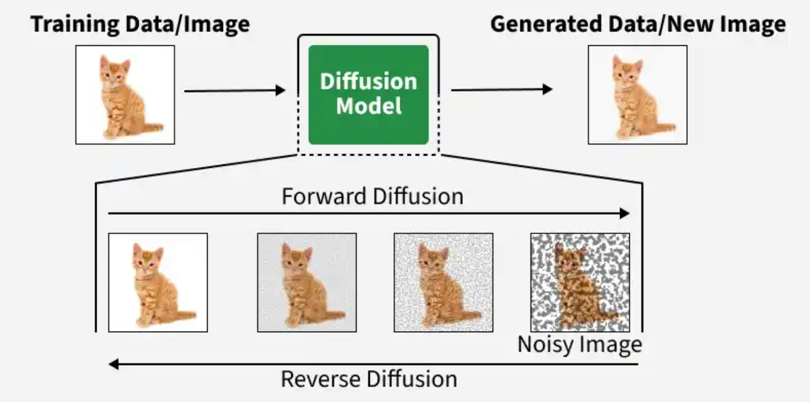
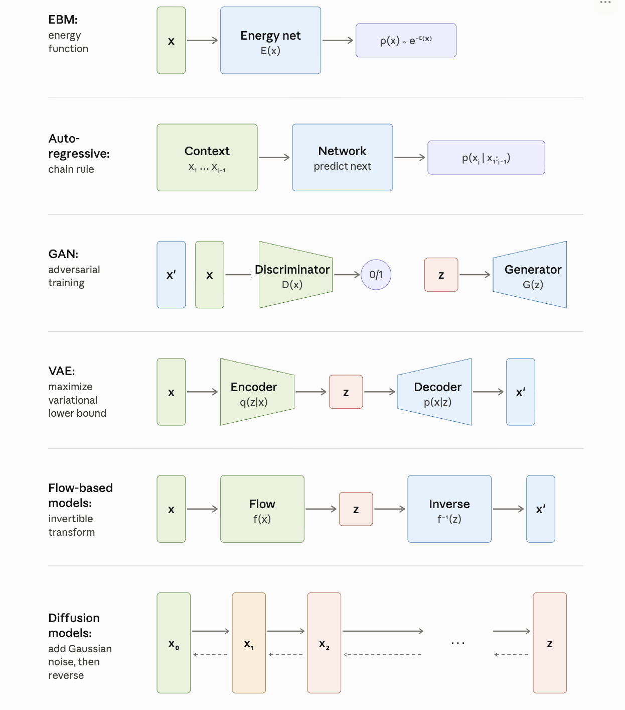

+++
date = '2026-05-20T15:29:19+08:00'
draft = false
title = 'Diffusion Basis (1)'
+++

# Abstract
As one of the most popular generative modeling approaches in recent years, the diffusion process is widely discussed, and there are many online tutorials explaining how diffusion training works. For most readers who are new to generative models (myself included), however, a more fundamental question comes first: *how do we understand diffusion intuitively?* Everyone probably has their own take on this. In this first chapter on the basics of diffusion, rather than diving into the mathematical details, we'll focus on building an intuitive, natural sense of what diffusion is and why it works.

Figure 1: Diffusion Overview

# What is diffusion?
On Wikipedia, the diffusion model is defined as *a class of latent-variable generative models*. We'll start with generative models, then unpack the two notions in turn: "generative model" and "latent variable."

A model (in the modern sense, a neural network) fits a function mapping; a generative model, as the name suggests, aims to generate the data itself. Any data (language, images, and so on) has some underlying structure and lives in a high-dimensional space. But not every point in that space corresponds to real data — most of it is unreadable noise. We represent real data by a random variable X following a complex, sparse distribution p(x). The core problem in designing a generative model is therefore: how do we model p(x) through the mapping defined by the network?

Note that generative models allow far more design freedom than discriminative ones. A discriminative model has a well-defined input (the data) and output (a label), so its structure is largely pinned down. A generative model, by contrast, must decide what its inputs and outputs even are in order to produce data. So let's first consider what network designs are available for generating data:

Figure 2: Design of the different generative models

**(1) Define the input as the data $x$ and the output as the (unnormalized) density value $p(x)$, then generate data by sampling.**
A representative approach here is the Energy-Based Model, which uses a network to learn an energy function $E(x)$ and defines the density via $p(x) \propto e^{-E(x)}$ — the lower a sample's energy, the more "plausible" it is. The major difficulty is how to sample from this distribution: it typically requires methods like MCMC, which converge extremely slowly. We won't go further into it here.

**(2) Decompose $p(x)$ as $\prod_{i=1}^{n} p(x_i \mid x_{1:i-1})$, and define the output as the conditional distribution $p(x_i \mid x_{1:i-1})$.**
This is the core idea of autoregressive models. By applying the chain rule of probability, a high-dimensional joint distribution $p(x)$ that is hard to model directly is turned into a product of low-dimensional conditional distributions that share the same structure. The decomposition is exact: it is a direct consequence of the chain rule and introduces no approximation — any joint distribution can be factored this way without loss.

**(3) Directly define the output as $x$.**
Most popular generative models use the data $x$ directly as the network output. Concretely, assume the input is a random variable $Z$; the network learns a mapping $z \to x$, and $p(x)$ is determined by $p(z)$ together with this mapping. We typically take $p(z)$ to be a high-dimensional standard normal. VAEs and GANs both belong to this paradigm; the difference lies in how the mapping is trained. A VAE, for instance, introduces an inference network $q(z \mid x)$ and learns by maximizing the ELBO. Flow-based models take yet another route: they require $z \to x$ to be strictly invertible, so data can be encoded into latents via the inverse map $f(x)$, and $p(x)$ can be computed exactly through the change-of-variables formula.
But carrying out the drastic transformation $z \to x$ in a single step places a heavy burden on the network. Here is the key observation: by repeatedly adding Gaussian noise to any $x$ according to a fixed schedule, its distribution eventually converges to a standard normal. In other words, there is a simple, universal forward process for "data → noise." We can then ask the network to learn the *reverse* process — starting from noise and gradually denoising to reconstruct the data. The single-step mapping $z \to x$ is thus replaced by a sequence of progressive denoising steps, which is the core idea of diffusion. Looking back at the definition of the diffusion model, the "latent variable" is exactly the input $Z$ we introduced in (3) — concretely, the pure-noise endpoint that generation starts from.

